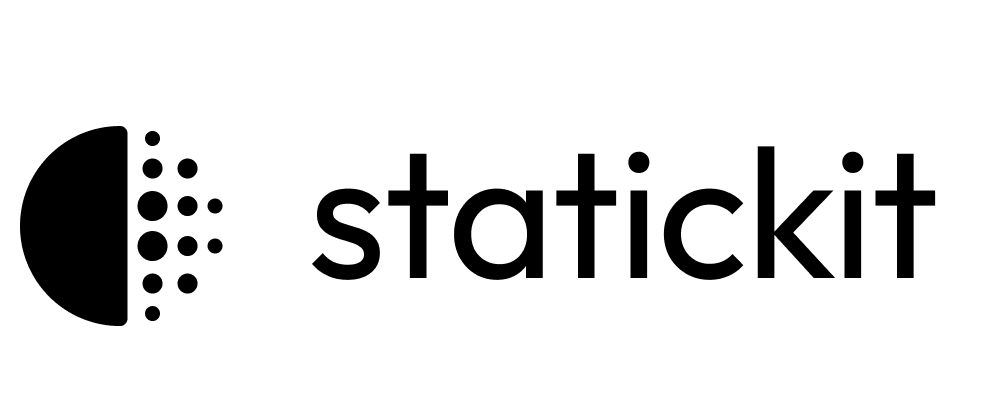
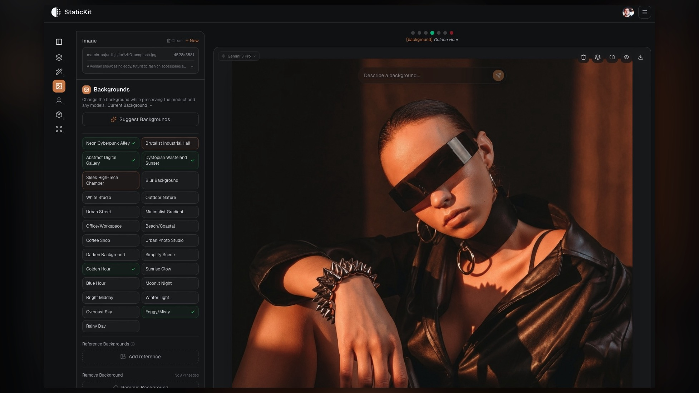

<p align="center">
  
</p>

<p align="center">
  A free, open-source front-end for AI image models
</p>

<p align="center">
  <a href="https://statickit.ai">
    
  </a>
  <a href="https://github.com/coreyrab/statickit/stargazers">
    
  </a>
  <a href="https://github.com/coreyrab/statickit/blob/main/LICENSE">
    
  </a>
  <a href="https://github.com/coreyrab/statickit/pulls">
    
  </a>
</p>

<p align="center">
  
</p>

---

StaticKit is an open-source frontend for AI image models. Instead of copy-pasting prompts into a chat interface, StaticKit gives you a proper editing UI with prompt engineering baked into presets. One click to swap a background, change lighting, or replace a model. The complex prompts happen under the hood.

**Bring your own API key. No watermarks. No subscriptions. Keys encrypted and synced across devices.**

## Features

**Core Editing**
- Natural language image editing
- Background swap with automatic lighting matching
- Model/person replacement while preserving pose and product
- Smart resize to any aspect ratio (extends or crops intelligently)
- Lighting presets (golden hour, studio, neon, etc.)

**Reference Images**
- Upload a reference photo to extract its background
- Use a specific person from a reference as the model
- Composite subjects into new environments

**Workflow**
- Version history with branching
- Compare mode for A/B testing variations side-by-side
- Batch download all versions and sizes
- Keyboard shortcuts for power users

**BYOK (Bring Your Own Key)**
- Use your own Gemini API key
- Free account with encrypted key storage
- Keys sync across all your devices
- No tracking, no vendor lock-in

## Quick Start

1. Clone the repo
   ```bash
   git clone https://github.com/CoreyRab/statickit.git
   cd statickit
   ```

2. Install dependencies
   ```bash
   npm install
   ```

3. Run the app
   ```bash
   npm run dev
   ```

4. Set up environment variables
   ```bash
   cp .env.example .env
   ```
   Fill in your [Convex](https://www.convex.dev/) URL, [Clerk](https://clerk.com/) keys, and generate an encryption key:
   ```bash
   openssl rand -hex 32
   ```

5. Create a free account and add your API key
   - Sign up with Google or email
   - Get a free Gemini API key from https://aistudio.google.com/apikey
   - Paste it when prompted (encrypted and synced across devices)

## Tech Stack

- Next.js 16 (App Router)
- TypeScript
- Tailwind CSS
- Radix UI
- Google Gemini API
- Zustand

## Contributing

Contributions welcome. See [CONTRIBUTING.md](.github/CONTRIBUTING.md).

## License

[MIT](LICENSE)
